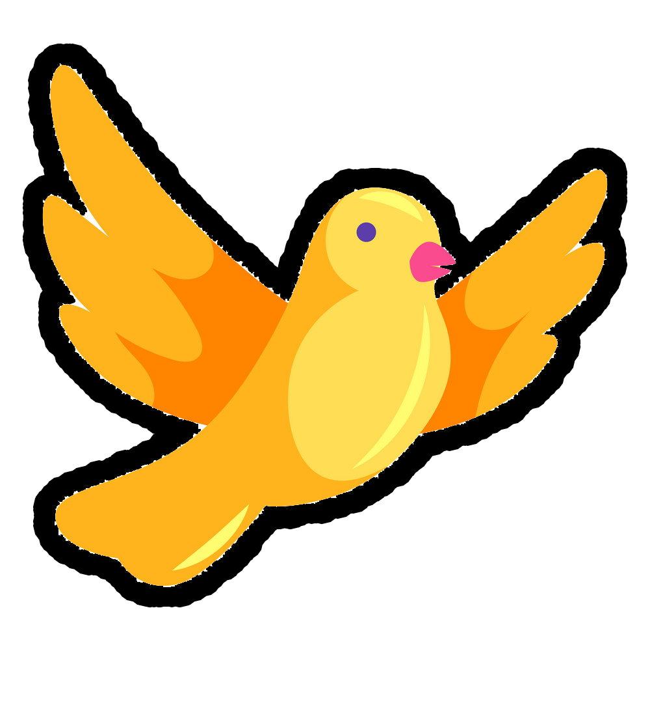

#### 26/02/2024

### The Cases

<p>Around the end of the first "CSS to The Rescue" lecture (given by Sanne 't Hooft and Nils Blinder), we were informed about the final assignment, containing 4 choices  </p>

<ul>
<li>Control Panel</li>
<li>Firework Show</li>
<li>Paper-airplane</li>
<li>Rubix Cube</li>
</ul>

<p>I picked fireworks for my project, but I wanted to spice it up. Just before the assessment, Sanne t'Hooft showed me some of his work that totally blew me away. It hardly had any JS, and I was like, "Wow!". My favorite one was <a href="https://sinds1971.nl/viswinkel/">Freddy's Fabulous Fish Tanks</a> It's like a mix of a control panel and fireworks, even though the fish obviously don't explode. But when you mix up all the species, they create this incredible display.</p>


<p>I went for a similar idea, but with birds this time. Picture a bunch of birds flying at different speeds. They put on a colorful show just like fireworks.They create a colorful spectacle just like fireworks. Each bird flies at a different speed, forming a diverse mix that can mesmerize the user. But here's the twist: the user can shoot the birds from the sky. Some are easier targets than others because of their speed. When shot, the birds simply fall off.</p>


<p>


</p>

<p>Here are some sketches to give you an idea of what I want to achieve. Each house has a different type of bird, each faster than the last. When you hover over these houses, you can see the birds peeking outClicking on several birdhouses will launch them to the center of the screen. One can add as much birds as they want to, but also shoot them down. Turning them red and drop them down.</p>

### How could this work? 

<p>I could consider using three different types of aninmations:</p>
<ul>
<li>One taking off, flying to the circle</li>
<li>It will then start flying in circles</li>
<li>And when it's shot, the death animation plays</li>
</ul>

<hr> 


#### 29/02/2024

<p>It was time to get to coding! The list-items part creates a list of birds with radio buttons for selection. Each list-items element represents a list item and contains an input radio button along with the name of the bird displayed as a paragraph. Each radio button has a unique name attribute to group them together, allowing the user to select only one bird at a time. </p>

```HTML
<!DOCTYPE html>
<html lang="en">
<head>
    <meta charset="UTF-8">
    <meta http-equiv="X-UA-Compatible" content="IE=edge">
    <meta name="viewport" content="width=device-width, initial-scale=1.0">
    <title>Testing Has</title>
    <link rel="stylesheet" href="./style.css">
</head>
<body>
    <header></header>
    <main>
        <ul>
            <li>
                <input type="radio" name="addBird1">
                <p>bird1</p>
            </li>
            <li>
                <input type="radio" name="addBird2">
                <p>bird2</p>
            </li>
            <li>
                <input type="radio" name="addBird3">
                <p>bird3</p>
            </li>
            <li>
                <input type="radio" name="addBird4">
                <p>bird4</p>
            </li>
            <li>
                <input type="radio" name="addBird5">
                <p>bird5</p>
            </li>
            <li>
                <input type="radio" name="addBird6">
                <p>bird6</p>
            </li>
            <li>
                <input type="radio" name="addBird7">
                <p>bird7</p>
            </li>
            <li>
                <input type="radio" name="addBird8">
                <p>bird8</p>
            </li>
        </ul>

    </main>
    <footer></footer>

</body>
</html>
```


<p>Regarding the CSS, I recognized that I would likely need to employ repetitive selectors to achieve the functionality I desired. However, this approach wasn't practical. Additionally, it would complicate any future changes, as identifying what adjustments I wanted to make would become akin to solving a large puzzle.</p>

```CSS
section:has( input[name^="addBird"]:checked) + article p  {
    display: block;
}

section:has( input[name="addBird2"]:checked) + article p:nth-of-type(2) {
    display: block;
} 


section input:nth-of-type(2) {
    display: none; 
}
section input:nth-of-type(3) {
    display: none; 
}
section input:nth-of-type(4) {
    display: none; 
}
section input:nth-of-type(5) {
    display: none; 
}

/* And so on, up to 19 */


section:has(input:first-of-type:checked) input:nth-of-type(2){
    display: block; 
}
section:has(input:nth-of-type(2):checked) input:nth-of-type(3){
    display: block; 
}
section:has(input:nth-of-type(3):checked) input:nth-of-type(4){
    display: block; 
}
section:has(input:nth-of-type(4):checked) input:nth-of-type(5){
    display: block; 
}

/* And once again, up to 19 */

```

<p>With Sanne's help, I created multiple variables for the list items, intending to create a method where my birds would dynamically appear with an added 'flying' animation. Each bird's speed and position are controlled by these custom variables. The list is styled as a grid, with radio buttons hidden by default. When a radio button is checked, the corresponding bird's name is displayed and animated to simulate flying. The animation moves the bird vertically while increasing its font size based on its position in the list.</p>

```CSS
li:nth-child(1)  { --i:1;  --x:10; --y:46; }
li:nth-child(2)  { --i:2;  --x:50; --y:68; }
li:nth-child(3)  { --i:3;  --x:23; --y:23; }
li:nth-child(4)  { --i:4;  --x:67; --y:97; }
li:nth-child(6)  { --i:6;  --x:91; --y:24; }
li:nth-child(5)  { --i:5;  --x:12; --y:56; }
li:nth-child(7)  { --i:7;  --x:33; --y:89; }
li:nth-child(8)  { --i:8;  --x:47; --y:35; }
li:nth-child(10) { --i:10; --x:13; --y:23; }


ul  {
    display: grid;
    justify-items: start;

    margin:0;
    padding:0;
    list-style:none;
}

ul li {
    grid-column-start:1;
    grid-row-start:1;
}

ul input {
    display:none;
}

input[name="addBird1"]:not(:checked) {
    display:block;
}

li:has(input:checked) + li input:not(:checked) {
    display:block;
}

p {
    display: none;
}


input:checked + p {
    display:block;
    animation: flying 1s ease;
    animation-iteration-count: infinite;
    font-size:calc(1em * var(--i));

    position: fixed;
    left: calc(1vw * var(--x));
    top: calc(1dvh * var(--y));
}

@keyframes flying {
    0% {
        translate: 0 10rem;
    }

    100% {

        translate: 0 1rem;
    }
}
```

<hr>

#### 01/03/2024


<p>It was time to get creative with styling! Although I'm still refining the HTML, I decided to start adding some design elements. After all, that's the essence of the course we're following, right? I searched online for some birdhouse SVGs, and I even found one with a matching bird.</p>

<p>

</p>

<p>I also edited the list-items, with the actual bird.</p>

### HTML before
```HTML
<li>
    <input type="radio" name="addBird5">
     <p>bird5</p>
</li>
```

### HTML after
```HTML
<li>
    <input type="radio" name="addBird8">
    
</li>
```

<p>I also edited the list-items variables with additional filters! Each time a bird would appear, it would be displayed in a different color. When a user selects a bird, it gracefully flies onto the screen with a smooth animation, while its size adjusts based on its position in the list. The radio buttons don't look like typical buttons; they're transformed into adorable birdhouses, adding a delightful touch to the interface. By hiding the default appearance of the radio buttons and cleverly inserting the birdhouse backgrounds, we ensure a cohesive and visually appealing design. Plus, organizing everything in a neat grid layout adds structure and makes navigation a breeze. Together, these CSS styles create a playful and engaging user experience that captures the essence of our webpage beautifully.</p>

### CSS After

```CSS
li:nth-child(1)  { --i:1;  --x:0; --y:0; filter: invert(14%) sepia(86%) saturate(6754%) hue-rotate(359deg) brightness(98%) contrast(115%);}
li:nth-child(2)  { --i:2;  --x:50; --y:68; filter: invert(89%) sepia(26%) saturate(2802%) hue-rotate(114deg) brightness(103%) contrast(101%);}
li:nth-child(3)  { --i:3;  --x:23; --y:23; filter: invert(10%) sepia(90%) saturate(7456%) hue-rotate(273deg) brightness(101%) contrast(121%);}
li:nth-child(4)  { --i:4;  --x:67; --y:97; filter: invert(76%) sepia(53%) saturate(598%) hue-rotate(344deg) brightness(100%) contrast(92%);}
li:nth-child(6)  { --i:6;  --x:91; --y:24; filter: invert(93%) sepia(24%) saturate(629%) hue-rotate(357deg) brightness(93%) contrast(102%);}
li:nth-child(5)  { --i:5;  --x:12; --y:56; filter: invert(90%) sepia(20%) saturate(900%) hue-rotate(57deg) brightness(101%) contrast(97%);}
li:nth-child(7)  { --i:7;  --x:33; --y:89; filter: invert(56%) sepia(75%) saturate(6663%) hue-rotate(324deg) brightness(98%) contrast(95%);}
li:nth-child(8)  { --i:8;  --x:47; --y:35; filter: invert(38%) sepia(100%) saturate(912%) hue-rotate(345deg) brightness(101%) contrast(102%);}
li:nth-child(10) { --i:10; --x:13; --y:23; filter: invert(48%) sepia(100%) saturate(5349%) hue-rotate(285deg) brightness(95%) contrast(131%);}


[type=radio] {
    appearance: none;
}

[type=radio]::before  {
    content: "";
    width: 4rem;
    height: 4rem;
    background-image: url(./imgs/birdhouse.svg);
    background-repeat: no-repeat;
    position: absolute;
    top: 2px;
    left: 2px;
    z-index: -1;
}

input:checked+img{
    display: block;
    animation: flying 1s ease;
    animation-fill-mode: forwards;
    font-size: calc(1em * var(--i));
    width: 3rem;
    position: fixed;
    left: calc(1vw * var(--x));
    top: calc(1dvh * var(--y));

    -webkit-transform: scaleX(-1);
    transform: scaleX(-1);

}
```

<p>
</p>
<hr>


### 03/03/2024

### BIG changes 


<p>Sanne helped me sketch out the birds, their homes, and the areas they're supposed to fly in on paper. We made sure to consider everything, like margins, padding, and how long the animations should last. Before, I was using an offset-path, but it didn't work out as I wanted. Sunflower (The Yellowbird) ended up flying in the wrong direction, and changing the viewport messed up everything's position.</p>

### BEFORE


### NEW CALCULATIONS (VARIABLES) 

```CSS
ul:first-of-type {
    --houseSize: 5em;
    --birdSize:calc( var(--houseSize) - var(--housePadding) * 2);
    --houseTop: calc( var(--navPadding) + var(--houseSize) * .5 );
    --housePadding: 1em; 

    --houseLeft: calc( 
            var(--navPadding) 
            + 
            (var(--i) - .5) * var(--houseSize) 
            + 
            (var(--i) - 1) * var(--navGap) 
        ); 


    position: relative;

    /* background-color: red; */
    background-image: 
        url("./birdhouse-hover.svg"),
        url("./birdhouse.svg");
    background-repeat: no-repeat;
    background-position:center;
    background-size: 0 0, contain;

    margin: 0;
    padding: 0;
    list-style: none;
    
    width: var(--houseSize);
    aspect-ratio: 1;

    display: grid;
}
```
<p>This code snippet styles the first <ul> element in a document, primarily for rendering a grid of birdhouses. It sets custom CSS variables to define sizes and positions relative to the birdhouses and birds, such as --houseSize for the size of the birdhouse and --birdSize for the bird's size. Additionally, it calculates the top and left positions of each birdhouse based on the number of birdhouses and the gap between them. The background image of each birdhouse is specified with a hover effect using SVG images. Margins, padding, and list styles are reset, while the width of the birdhouse and its aspect ratio are defined. Finally, the display is set to a grid layout for optimal alignment of birdhouses.</p>

### Background
<p>I decided to jazz up the style by adding a background. That's when I thought about clouds. I thought, why not animate clouds and a sun? And when you switch on the day-night mode, instead of just a quick change, imagine everything shifting slowly, almost like a theatrical performance. It's all about timing, making sure each element transitions smoothly.</p>


```CSS
body {
    background-image: url(./imgs/background.svg);
    background-size: cover;
}
```

<p>I would first add a regular empty background.</p>


<p>After that, I threw in some more scenery like clouds, the sun, and the first birdhouse. So basically, when the user clicks on the house, a bird pops up and flies to the center of the screen, adjusting for the width of their browser.</p>


### The Result
<p>
</p>


## Meet Teal! 
<p>After the success of the first bird, I decided to add a second one to make things more entertaining. Teal is a cheerful bird that enjoys flying in loops and is slightly faster than Sunflower (the Yellow Bird).</p>


